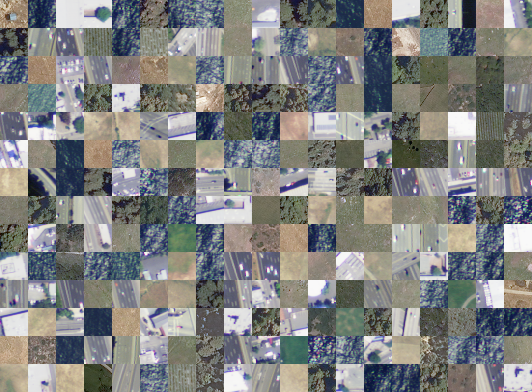

# 🛰️ TerraClass: Terrain Classification using Deep Learning

## 📌 Project Overview

TerraClass is a deep learning project focused on the automated classification of satellite imagery for land-use analysis. The primary goal is to accurately categorize `28x28` pixel satellite image tiles into one of six distinct land-use classes: barren land, trees, grassland, roads, water, and buildings. The project explores the effectiveness of both a custom-built Convolutional Neural Network (CNN) and a transfer learning approach using powerful pre-trained models.

This project is a testament to the potential of deep learning in remote sensing, providing a robust framework for environmental monitoring, urban planning, and disaster management.

## 🔗 Live Demo & Repository
- **Repository**: [TerraClass on GitHub](https://github.com/DK-SAI07/TerraClass-Terrain-Classification-using-Deep-Learning.git)
- **Demo**: No live demo yet—run the notebooks locally to see the magic! (Future work: WebApp UI Dev & Deployment)

------------------------------------------------------------------------
## ✨ Features

* **Custom CNN:** A custom-designed, lightweight Convolutional Neural Network from scratch that serves as a highly effective baseline model.
* **Transfer Learning:** Integration of pre-trained **VGG16** and **ResNet50** models to leverage powerful feature extraction capabilities.
* **High-Resolution Data:** Utilizes high-resolution satellite imagery from the National Agriculture Imagery Program (NAIP) via the DeepSat-6 dataset.
* **High Accuracy:** The custom CNN model achieved a best validation accuracy of **97.5%**, outperforming the transfer learning models. The transfer learning approach attained a maximum of **96.4%** validation accuracy.
* **Comprehensive Evaluation:** Provides detailed analysis of model performance through training/validation plots, classification reports, and confusion matrices.
* **Optimized Workflows:** The project demonstrates a complete workflow from data preprocessing and model training to final evaluation and analysis of misclassifications.

------------------------------------------------------------------------
## 🛠️ Tech Stack
* **Framework:** TensorFlow, Keras
* **Language:** Python
* **Data Handling:** NumPy, pandas, `scipy.io`
* **Visualization:** Matplotlib, Seaborn
* **Machine Learning:** Scikit-learn
* **Environment:** Jupyter Notebook
* **Version Control**: Git, Git LFS for large files
## 📄 Dataset Details

<table>
<tr>
<td width="60%">

This project utilizes the **DeepSat (SAT-6) Airborne Dataset**.  
It consists of **405,000 image** patches each of size 28x28 and covering **6 land-cover classes**. <br/>
Since the dataset is over >5GB, it is **not included in this repository**.  

➡️ Instructions to download are provided in [`dataset/Dataset-Instructions.pdf`](dataset/Dataset_Instructions.pdf) file.  

- **Source:** [DeepSat-6 on Kaggle](https://www.kaggle.com/datasets/crawford/deepsat-sat6/data?select=sat-6-full.mat)  
- **Resolution:** 28×28 pixels, 4 bands (R, G, B, NIR)  
- **Classes:** `Barren Land, Trees, Grassland, Roads, Water, Buildings`

> **Note:**  
> Don’t worry, everything’s covered — just check the PDF and Kaggle link. 📦

</td>
<td width="40%">

</td>
</tr>
</table>


------------------------------------------------------------------------
## 🗂️ Folder Structure

``` bash
TerraClass-Terrain-Classification-using-Deep-Learning/
├── DL_Cust_Model/                 # Custom CNN model (baseline)
│   └── Custom CNN.ipynb
│
├── DL_Res50_Model/                # Transfer learning with ResNet50
│   └── ResNet50.ipynb
│
├── DL_VGG16_Model/                # Transfer learning with VGG16
│   └── VGG16.ipynb
│
├── dataset/                    
│   ├── Dataset_Instructions.pdf   # Kaggle dataset link & setup
│   ├── res_baseline.weights.h5    # ResNet50 trained weights
│   ├── res_history.csv            # ResNet50 training history
│   ├── sat_img.png                # Sample from DeepSat-6 dataset
│   ├── vgg_baseline.weights.h5    # VGG16 trained weights
│   └── vgg_history.csv            # VGG16 training history
├── LICENSE.md
└── README.md            
```

------------------------------------------------------------------------
## ⚙️ Installation

To set up the project on your local machine, follow these steps:
1. **Clone the repository**:
    ```bash
    git clone https://yourusername/TerraClass-Terrain-Classification-using-Deep-Learning.git
    cd TerraClass-Terrain-Classification-using-Deep-Learning
    ```
2.  **Download the Dataset:** Follow the instructions provided in `dataset/Dataset_Instructions.pdf` to download the `DeepSat SAT-6
` files from Kaggle and place it in the `dataset/` folder.
3.  **Install Dependencies:** Ensure you have Python 3.8+ and all the necessary Python libraries installed.
    ```bash
    pip install tensorflow keras numpy pandas matplotlib seaborn scikit-learn scipy 
    ```

## 💻 Usage

Once the installation is complete, you can explore the project's models and results by opening the Jupyter Notebooks.

* To run the **Custom CNN** model, open `DL_Cust_Model/Custom CNN.ipynb`.
* To run the **VGG16** transfer learning model, open `DL_VGG16_Model/VGG16.ipynb`.
* To run the **ResNet50** transfer learning model, open `DL_Res50_Model/ResNet50.ipynb`.

The notebooks are configured to load pre-trained weights by default, allowing for quick evaluation of the models. If you wish to retrain a model, simply set the `load_weights` variable to `False` in the respective notebook.

------------------------------------------------------------------------
## 📊 Results & Analysis

The models were rigorously evaluated on a held-out (unseen) test dataset of 81,000 images. Notably, the custom-built CNN delivered strong performance, highlighting that a well-designed lightweight model can compete closely with deeper, pre-trained architectures for this specific task.

| Model                 | Test Accuracy |
| :-------------------- | :------------ |
| **Custom CNN** | **97.5%** |
| VGG16 (Transfer)      | 96.4%         |
| ResNet50 (Transfer)   | 79%           |

**Key Observations:**

- The custom CNN outperformed the transfer learning models, achieving the highest accuracy.
- Evaluation using classification reports and confusion matrices revealed that the most frequent classification errors involved confusing `barren land` with `grassland` and `grassland` with `trees`.
- These misclassifications suggest that the spectral or spatial characteristics of these land types may overlap in the feature space used by the model.
------------------------------------------------------------------------
## 🚀 Future Work

Based on the project's findings and analysis, future work could focus on several key areas to enhance the model's capabilities and practical utility.

### 1. Spatial Accuracy and Resolution Improvement
- **Refined Classification Workflow:** A more refined workflow could be implemented to improve spatial accuracy. This would involve classifying partially overlapping image tiles and assigning classification results specifically to the center-most pixels of each tile.  
- **Enhanced Pixel-Level Resolution:** This refined approach would increase the spatial accuracy of the final classification map by enhancing pixel-level resolution, leading to finer granularity in land use delineation across large areas.

### 2. Georeferencing and User Interface Development
- **Spatial Metadata Restoration:** Future work could extend the application to include a workflow for georeferencing, which involves restoring the spatial metadata of the reassembled land use classification.  
- **Complex Spatial Evaluations:** This enhancement would enable more complex spatial evaluations, such as calculating statistics over different regions (e.g., class distribution by county).  
- **Interactive User Interfaces:** Developing user interfaces to interact with the classified output would further enhance the utility of the system.

### 3. Model Generalization and Class Differentiability
- **Adapting to Diverse Datasets:** Future research may focus on adapting the framework to more diverse satellite datasets for generalization.  
- **Improving Class Differentiability:** Efforts should also be made to improve the model's ability to differentiate between similar classes, such as grassland and barren land, which were identified as challenging during misclassification analysis.

------------------------------------------------------------------------
## 👨🏻‍💻 Acknowledgements
- We sincerely acknowledge the Original Creators of the DeepSat-6 dataset for making this data publicly available.
- Special thanks to the Open-Source community for tools like TensorFlow, Keras, and more.

------------------------------------------------------------------------
## 📜 License

This project is licensed under the MIT License. See
[LICENSE.md](./LICENSE) for more info.

------------------------------------------------------------------------
## 🙋🏻‍♂️ Need Help?

If you have questions, find bugs, or want to contribute, feel free to:

- Open an issue in this repo  
- Contact me at [saisameer.kumar95@gmail.com](mailto:saisameer.kumar95@gmail.com)  
- Connect on [LinkedIn](https://www.linkedin.com/in/sameerkumar-divi/)

> *“The best way to get a project done faster is to start sooner.”* – Jim Highsmith 


**Don’t hesitate to reach out — collaboration makes it better!**
